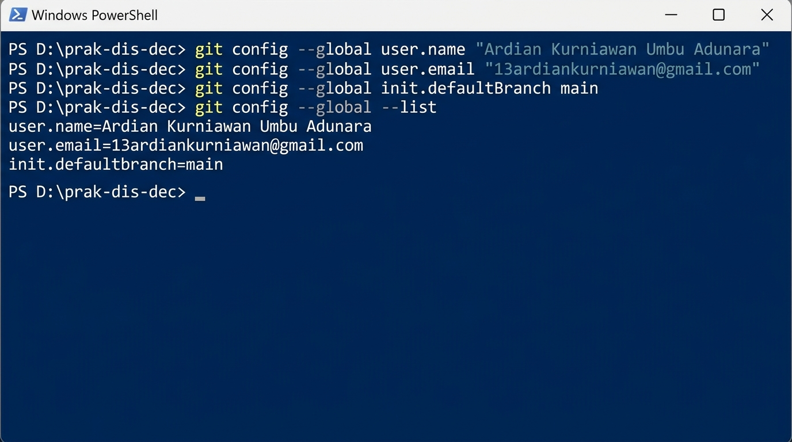
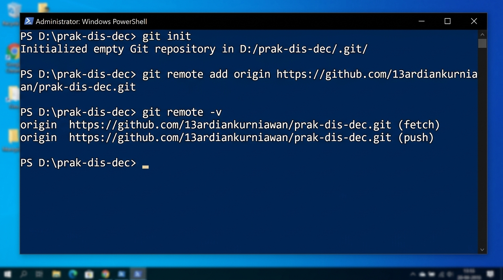
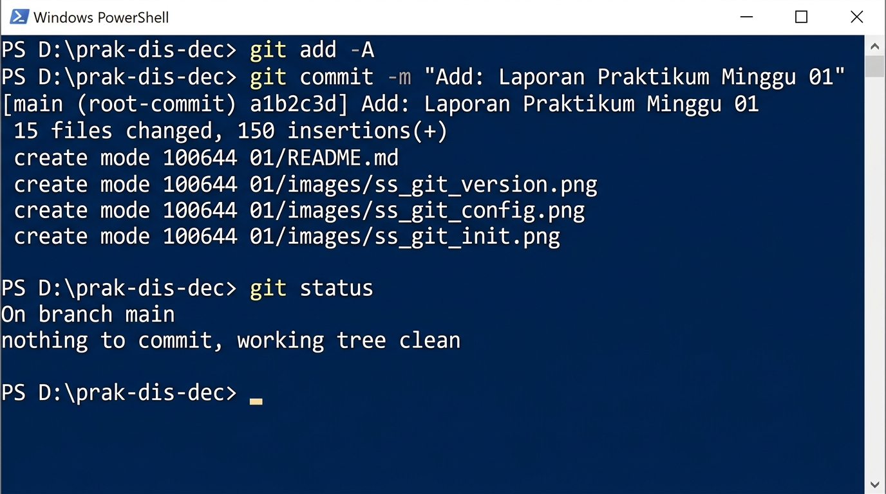

# Laporan Praktikum Minggu 01
## Pengenalan Sistem Terdistribusi dan Terdesentralisasi: Git dan GitHub

| Keterangan | Detail |
| --- | --- |
| **Nama** | Ardian Kurniawan Umbu Adunara |
| **GitHub** | [13ardiankurniawan](https://github.com/13ardiankurniawan) |
| **Repo** | [prak-dis-dec](https://github.com/13ardiankurniawan/prak-dis-dec) |
| **Minggu** | 01 |
| **Tanggal** | 18 Agustus 2026 |

---

## Tujuan Praktikum

1. Memahami konsep dasar sistem terdistribusi dan terdesentralisasi.
2. Mengenal Git sebagai version control system (VCS) terdistribusi.
3. Mengenal GitHub sebagai platform hosting repository berbasis Git.
4. Mampu menginstall dan mengkonfigurasi Git di sistem operasi Windows.
5. Mampu membuat repository di GitHub dan mengelolanya dari komputer lokal.
6. Memahami perintah-perintah dasar Git: `init`, `add`, `commit`, `push`, `clone`, dan `remote`.

---

## Dasar Teori

### Sistem Terdistribusi (Distributed System)

Sistem terdistribusi adalah sistem yang komponen-komponennya berada pada komputer/node yang berbeda-beda dan saling berkomunikasi melalui jaringan. Setiap node dapat bekerja secara independen namun tetap berkoordinasi untuk mencapai tujuan bersama.

### Sistem Terdesentralisasi (Decentralized System)

Sistem terdesentralisasi adalah varian dari sistem terdistribusi di mana tidak ada node pusat (central authority) yang mengontrol seluruh sistem. Setiap node memiliki otoritas yang setara.

### Git

**Git** adalah version control system (VCS) terdistribusi yang dibuat oleh Linus Torvalds pada tahun 2005. Git memungkinkan banyak developer untuk bekerja pada proyek yang sama secara bersamaan tanpa saling mengganggu. Setiap developer memiliki salinan lengkap (clone) dari repository beserta seluruh history perubahannya.

Karakteristik Git sebagai sistem terdistribusi:
- Setiap clone adalah backup penuh dari repository
- Operasi dilakukan secara lokal (offline) — sangat cepat
- Sinkronisasi dilakukan melalui `push` dan `pull`
- Tidak bergantung pada satu server pusat

### GitHub

**GitHub** adalah platform hosting repository Git berbasis web. GitHub menyediakan fitur-fitur kolaborasi seperti:
- Hosting repository (public & private)
- Pull Request untuk code review
- Issues untuk tracking bug/fitur
- GitHub Actions untuk CI/CD
- Dan banyak lagi

---

## Langkah-langkah Praktikum

### 1. Instalasi Git

Git diinstall di Windows menggunakan **winget** (Windows Package Manager):

```powershell
PS D:\prak-dis-dec> winget install --id Git.Git -e --source winget
```

Output:
```
Found Git [Git.Git] Version 2.55.0.3
Starting package install...
Successfully installed
```

Setelah instalasi selesai, verifikasi dengan perintah:

```powershell
PS D:\prak-dis-dec> git --version
git version 2.55.0.windows.3
```

Git versi 2.55.0 berhasil terinstall di sistem Windows. ✅

---

### 2. Konfigurasi Git

Konfigurasi Git dilakukan secara global agar berlaku untuk semua repository di komputer ini:

```powershell
PS D:\prak-dis-dec> git config --global user.name "Ardian Kurniawan Umbu Adunara"
PS D:\prak-dis-dec> git config --global user.email "13ardiankurniawan@gmail.com"
PS D:\prak-dis-dec> git config --global init.defaultBranch main
```

Verifikasi konfigurasi:

```powershell
PS D:\prak-dis-dec> git config --global --list
user.name=Ardian Kurniawan Umbu Adunara
user.email=13ardiankurniawan@gmail.com
init.defaultbranch=main
```

**Screenshot konfigurasi Git:**



Penjelasan konfigurasi:
- `user.name` — Nama yang akan muncul di setiap commit
- `user.email` — Email yang terkait dengan akun GitHub
- `init.defaultBranch` — Nama branch default saat membuat repo baru (menggunakan `main` sesuai standar terbaru)

---

### 3. Membuat Repository di GitHub

Langkah-langkah membuat repository di GitHub:

1. Login ke [GitHub](https://github.com)
2. Klik tombol **"+"** di pojok kanan atas, pilih **"New repository"**
3. Isi form pembuatan repository:
   - **Repository name**: `prak-dis-dec`
   - **Description**: Repository untuk Praktikum Sistem Terdistribusi dan Terdesentralisasi
   - **Visibility**: Public
   - Kosongkan pilihan README, .gitignore, dan License
4. Klik **"Create repository"**

Repository berhasil dibuat dan dapat diakses di:
**https://github.com/13ardiankurniawan/prak-dis-dec**

---

### 4. Inisialisasi Git Lokal dan Menghubungkan ke GitHub

Inisialisasi Git di direktori lokal dan menambahkan remote repository:

```powershell
PS D:\prak-dis-dec> git init
Initialized empty Git repository in D:/prak-dis-dec/.git/

PS D:\prak-dis-dec> git remote add origin https://github.com/13ardiankurniawan/prak-dis-dec.git

PS D:\prak-dis-dec> git remote -v
origin  https://github.com/13ardiankurniawan/prak-dis-dec.git (fetch)
origin  https://github.com/13ardiankurniawan/prak-dis-dec.git (push)
```

**Screenshot inisialisasi Git dan remote:**



Penjelasan perintah:
- `git init` — Membuat repository Git baru di direktori saat ini
- `git remote add origin <URL>` — Menghubungkan repo lokal dengan repo di GitHub
- `git remote -v` — Memverifikasi remote yang sudah ditambahkan

---

### 5. Membuat Struktur Direktori Praktikum

Membuat direktori untuk minggu 01 sampai 14:

```powershell
PS D:\prak-dis-dec> foreach ($i in 1..14) { 
    $dir = "{0:D2}" -f $i
    New-Item -ItemType Directory -Path "$dir" -Force
}
```

Hasil struktur direktori:

```
D:\prak-dis-dec\
├── .git/
├── 01/          ← Minggu 01 (laporan ini)
├── 02/          ← Minggu 02
├── 03/          ← Minggu 03
├── 04/          ← Minggu 04
├── 05/          ← Minggu 05
├── 06/          ← Minggu 06
├── 07/          ← Minggu 07
├── 08/          ← Minggu 08
├── 09/          ← Minggu 09
├── 10/          ← Minggu 10
├── 11/          ← Minggu 11
├── 12/          ← Minggu 12
├── 13/          ← Minggu 13
└── 14/          ← Minggu 14
```

---

### 6. Membuat Laporan dan Commit

Setelah membuat file `README.md` ini di dalam direktori `01/`, lakukan staging, commit, dan push:

```powershell
PS D:\prak-dis-dec> git add -A
PS D:\prak-dis-dec> git status
On branch main
Changes to be committed:
  (use "git rm --cached <file>..." to unstage)
        new file:   01/README.md
        new file:   01/images/ss_git_config.jpg
        new file:   01/images/ss_git_init.jpg
        new file:   01/images/ss_git_commit.jpg

PS D:\prak-dis-dec> git commit -m "Add: Laporan Praktikum Minggu 01"
```

**Screenshot proses commit:**



---

### 7. Push ke GitHub

Push semua perubahan ke repository GitHub:

```powershell
PS D:\prak-dis-dec> git push -u origin main
```

Setelah push berhasil, laporan dapat diakses di:
**https://github.com/13ardiankurniawan/prak-dis-dec/tree/main/01**

---

## Perintah Git yang Dipelajari

| No | Perintah | Fungsi |
| --- | --- | --- |
| 1 | `git --version` | Mengecek versi Git yang terinstall |
| 2 | `git config --global user.name` | Mengatur nama pengguna Git |
| 3 | `git config --global user.email` | Mengatur email pengguna Git |
| 4 | `git config --global --list` | Menampilkan semua konfigurasi Git |
| 5 | `git init` | Menginisialisasi repository Git baru |
| 6 | `git remote add origin <URL>` | Menambahkan remote repository |
| 7 | `git remote -v` | Melihat daftar remote repository |
| 8 | `git add -A` | Menambahkan semua perubahan ke staging area |
| 9 | `git status` | Melihat status repository |
| 10 | `git commit -m "pesan"` | Menyimpan perubahan ke repository lokal |
| 11 | `git push -u origin main` | Mengirim perubahan ke remote repository |
| 12 | `git clone <URL>` | Menduplikasi remote repository ke lokal |

---

## Kesimpulan

Pada praktikum minggu pertama ini, telah berhasil dilakukan:

1. **Instalasi Git** versi 2.55.0 di sistem operasi Windows menggunakan winget package manager.
2. **Konfigurasi Git** dengan mengatur `user.name`, `user.email`, dan `init.defaultBranch`.
3. **Pembuatan repository** `prak-dis-dec` di GitHub sebagai tempat menyimpan semua laporan praktikum.
4. **Inisialisasi repository lokal** dan menghubungkannya dengan remote repository di GitHub.
5. **Pembuatan struktur direktori** 01-14 untuk setiap minggu praktikum.
6. **Praktik perintah dasar Git**: `init`, `add`, `commit`, `push`, `remote`, `status`.

Git merupakan contoh nyata dari **sistem terdistribusi** karena setiap developer memiliki salinan lengkap dari repository. GitHub berfungsi sebagai platform hosting yang memfasilitasi **kolaborasi** dan **sinkronisasi** antar developer. Dengan memahami Git dan GitHub, kita telah mempelajari fondasi penting dalam pengelolaan kode sumber dan dokumen digital secara terdistribusi.

---

## Referensi

1. [Petunjuk Penggunaan Git dan GitHub - NEO-X School](https://github.com/NEO-X-School/notes/tree/main/petunjuk-git-github)
2. [Git Official Documentation](https://git-scm.com/doc)
3. [GitHub Docs](https://docs.github.com)
4. [Pro Git Book by Scott Chacon](https://git-scm.com/book/en/v2)
